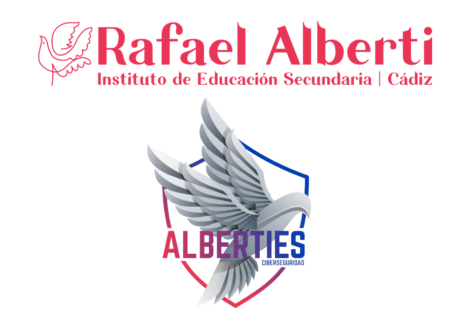

---
hide:
  - navigation
---

# Curso de Especialización en Ciberseguridad en Entornos de las Tecnologías de la Información

La ciberseguridad es una necesidad esencial para una sociedad en la que la tecnología y los servicios de información impregnan todos los aspectos de nuestras vidas. Asegurar nuestros sistemas digitales y de control de infraestructuras es actualmente una demanda crucial en un mundo hiperconectado caracterizado por continuos ataques de ciberseguridad. 

La ciberseguridad tiene la tasa de crecimiento más rápida entre todas las áreas de TI, es por ello que el mercado laboral enfrenta una grave escasez de mano de obra en dicho área. El objetivo de este curso de especialización es proporcionar al alumnado conocimientos técnicos esenciales, así como competencias y habilidades de investigación en el área de la ciberseguridad.

## Acerca del curso

  El curso es de naturaleza técnica y práctica, está integrado de manera única en la industria y se desarrolla en temas técnicos centrales dentro del área de ciberseguridad, como la seguridad de sistemas y redes, pruebas de penetración, programación segura, detección y gestión de incidentes, y análisis forense.

## ¿Cuáles son las salidas profesionales?

  Este campo tiene la tasa de crecimiento más rápida dentro del sector de las tecnologías de la información. Teniendo en cuenta la gran demanda de diversos tipos de roles en el dominio de la seguridad informática, los titulados de este curso pueden desempeñar los siguientes roles: 
  
  * Experto/a en ciberseguridad.
  * Auditor/a de ciberseguridad.
  * Consultor/a de ciberseguridad.
  * Hacker ético.
  * Analista Forense

## ¿Para quién es el curso?

  Este curso es ideal para personas que deseen desarrollar una carrera como profesional de ciberseguridad; asumir un papel técnico o de gestión; para progresar más rápido en su empleo o para aplicar el conocimiento en su función actual.

## Requisitos de entrada

  Los títulos que dan acceso a este curso de especialización son los siguientes:

  * Título de Técnico Superior en Administración de Sistemas Informáticos en Red.
  * Título de Técnico Superior en Desarrollo de Aplicaciones Multiplataforma.
  * Título de Técnico Superior en Desarrollo de Aplicaciones Web.
  * Título de Técnico Superior en Sistemas de Telecomunicaciones e Informáticos.
  * Título de Técnico Superior en Mantenimiento Electrónico.

## Duración

  720 horas (24 semanas)
  
## Presentación

[Presentación del Curso de Especialización en Ciberseguridad TIC](https://fpciberseguridad.com/informacion/presentacion.html)