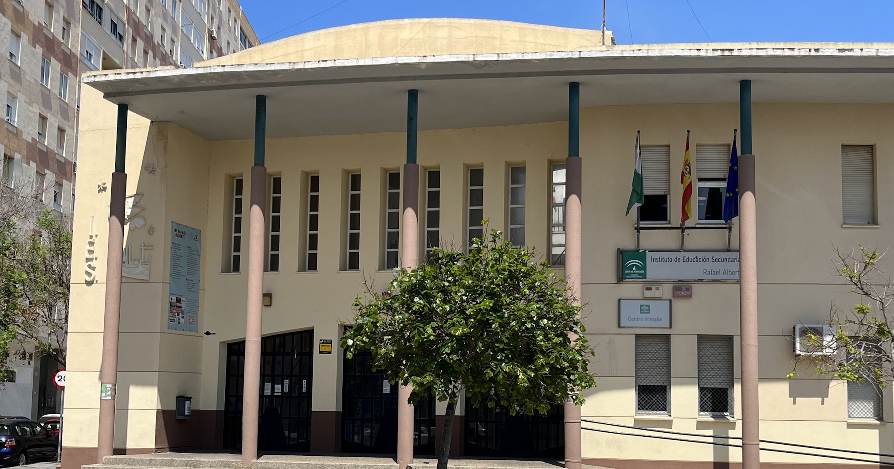

---
hide:
  - navigation
---

# Nuestro centro

## IES Rafael Alberti

El [IES Rafael Alberti](https://iesrafaelalberti.es/) se ha convertido en los últimos años en un referente en el ámbito educativo de la Ciberseguridad. Ha conseguido, entre otras distinciones, [el primer puesto en las dos últimos ediciones de las Olimpiadas de Ciberseguridad](https://www.diariodecadiz.es/cadiz/IES-Rafael-Aberti-ganador-Olimpiadas-Ciberseguridad_0_1414658709.html) para centros educativos (CyberOlympics), organizadas por el Instituto Nacional de Ciberseguridad (INCIBE), entidad dependiente del Ministerio de Economía y Empresa a través de la Secretaría de Estado para el Avance Digital.

Además su programa educativo sobre la enseñanza de la ciberseguridad ha obtenido reconocimientos como, [el premio nacional 12ENISE organizado por el INCIBE a la mejor iniciativa en materia de ciberseguridad](https://www.diariodecadiz.es/cadiz/premio-IES-Rafael-Alberti-ciberseguridad_0_1294371032.html), [premio Cádiz Joven en el Ámbito Educativo](https://www.lavozdigital.es/cadiz/sierra/lvdi-junta-entrega-premios-cadiz-joven-2018-201812141048_noticia.html), o el [premio nacional otorgado por la Agencia Española de Protección de Datos](https://www.diariodecadiz.es/cadiz/IES-Alberti-Nacional-Espanola-Proteccion_0_1432357173.html) y recibido en el senado, por el proyecto 'Buenas prácticas educativas en privacidad y protección de datos personales para un uso seguro de internet'.

Estamos convencidos que existe mucho talento en Ciberseguridad, despertar e impulsar dicho talento entre los más jóvenes, así como ayudarles a identificar las posibles trayectorias profesionales es uno de los principales objetivos de nuestro programa educativo. Para ello realizamos diversas actividades, como las jornadas de ciberseguridad "[Security High School Cádiz](https://cadiz.securityhighschool.es/)", unas jornadas para el alumnado y organizadas por el alumnado. 

En los últimos años [estudiantes del IES Rafael Alberti han formado parte de la selección española](https://www.diariodecadiz.es/cadiz/alumnos-gaditanos-equipo-espanol-olimpiadas-ciberseguridad_0_1457854619.html) que ha competido en la European Cyber Security Challenge, la llamada ‘Eurocopa’ de la Ciberseguridad, así como en otras competiciones internacionales.

## ¿Dónde estamos?

[Calle Amiel, S/N, 11012 Barriada de la Paz, Cádiz](https://goo.gl/maps/fXo7jzwtANf6tiM47)

<iframe width="425" height="350" frameborder="0" scrolling="no" marginheight="0" marginwidth="0" src="https://www.openstreetmap.org/export/embed.html?bbox=-6.276867985725404%2C36.51209809175302%2C-6.273005604743958%2C36.51358340660678&amp;layer=cyclemap&amp;marker=36.512839674865816%2C-6.27493679523468" style="border: 1px solid black"></iframe> <small><a href="https://www.openstreetmap.org/?mlat=36.51284&amp;mlon=-6.27494#map=19/36.51284/-6.27494&amp;layers=C">Ver mapa más grande</a></small>