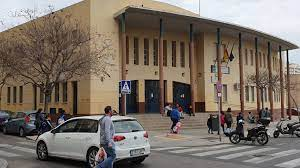

---
Curso de especialización en ciberseguridad TIC
===

---
## Índice
 - [Nuestro centro](#nuestro-centro)
 - [Presentación del curso](#presentación-del-curso)
 - [Programa de becas](#programa-de-becas)
 - [Módulos profesionales](#módulos-profesionales)
 - [Proyecto intermodular](#proyecto-intermodular)
 - [Profesorado](#profesorado)
 - [Horario](#horario)
 - [Calendario escolar](#calendario-escolar)
 - [Localización](#localización)
 - [Enlaces de interés](#enlaces-de-interés)

---
## Nuestro centro
El [IES Rafael Alberti](https://iesrafaelalberti.es/) se ha convertido en los últimos años en un referente en el ámbito educativo de la Ciberseguridad. Ha conseguido, entre otras distinciones, [el primer puesto en las dos últimos ediciones de las Olimpiadas de Ciberseguridad](https://www.diariodecadiz.es/cadiz/IES-Rafael-Aberti-ganador-Olimpiadas-Ciberseguridad_0_1414658709.html) para centros educativos (CyberOlympics), organizadas por el Instituto Nacional de Ciberseguridad (INCIBE), entidad dependiente del Ministerio de Economía y Empresa a través de la Secretaría de Estado para el Avance Digital.

Además su programa educativo sobre la enseñanza de la ciberseguridad ha obtenido reconocimientos como, [el premio nacional 12ENISE organizado por el INCIBE a la mejor iniciativa en materia de ciberseguridad](https://www.diariodecadiz.es/cadiz/premio-IES-Rafael-Alberti-ciberseguridad_0_1294371032.html), [premio Cádiz Joven en el Ámbito Educativo](https://www.lavozdigital.es/cadiz/sierra/lvdi-junta-entrega-premios-cadiz-joven-2018-201812141048_noticia.html), o el [premio nacional otorgado por la Agencia Española de Protección de Datos](https://www.diariodecadiz.es/cadiz/IES-Alberti-Nacional-Espanola-Proteccion_0_1432357173.html) y recibido en el senado, por el proyecto 'Buenas prácticas educativas en privacidad y protección de datos personales para un uso seguro de internet'.

Estamos convencidos que existe mucho talento en Ciberseguridad, despertar e impulsar dicho talento entre los más jóvenes, así como ayudarles a identificar las posibles trayectorias profesionales es uno de los principales objetivos de nuestro programa educativo. Para ello realizamos diversas actividades, como las jornadas de ciberseguridad "[Security High School Cádiz](https://cadiz.securityhighschool.es/)", unas jornadas para el alumnado y organizadas por el alumnado. 

En los últimos años [estudiantes del IES Rafael Alberti han formado parte de la selección española](https://www.diariodecadiz.es/cadiz/alumnos-gaditanos-equipo-espanol-olimpiadas-ciberseguridad_0_1457854619.html) que ha competido en la European Cyber Security Challenge, la llamada ‘Eurocopa’ de la Ciberseguridad, así como en otras competiciones internacionales.

## Presentación del curso
La ciberseguridad es una necesidad esencial para una sociedad moderna en la que la tecnología y los servicios de información impregnan todos los aspectos de nuestras vidas. La ciberseguridad tiene la tasa de crecimiento más rápida entre todas las áreas de TI, y el mercado laboral enfrenta una grave escasez de mano de obra en este campo.

El objetivo de este curso de especialización es proporcionar al alumnado conocimientos técnicos expertos esenciales, competencia y habilidades de investigación de los conceptos técnicos más importantes de la ciberseguridad y cómo se aplican en áreas emergentes de dicha especialidad.

[Descargar la presentación del curso de especializaciñon en ciberseguridad TIC]()

  
Acerca del curso

  El curso es de naturaleza técnica y práctica, está integrado de manera única en la industria y se desarrolla en temas técnicos centrales dentro del área de ciberseguridad, como seguridad de la información, programación segura, seguridad de sistemas y redes, pruebas de penetración, legislación aplicable al ámbito de la ciberseguridad, la detección y gestión de incidentes, así como también en el análisis forense.

  
¿Cuáles son las salidas profesionales?

  Este campo tiene la tasa de crecimiento más rápida en comparación con el resto de trabajos de tecnología. Teniendo en cuenta la gran demanda de diversos tipos de trabajos en el dominio de la seguridad informática que existen actualmente en el mercado, los titulados ​​de este curso pueden desempeñar los siguientes roles: 
  * Experto/a en ciberseguridad.
  * Auditor/a de ciberseguridad.
  * Consultor/a de ciberseguridad.
  * Hacker ético.
  * Analista Forense

  
¿Para quién es el curso?

  Este curso es ideal para personas que deseen desarrollar una carrera como profesional de ciberseguridad; asumir un papel técnico o de gestión de liderazgo; para progresar más rápido en su empleo o para aplicar el conocimiento en su función actual.

  
Requisitos de entrada

  Los títulos que dan acceso a este curso de especialización son los siguientes:

  * Título de Técnico Superior en Administración de Sistemas Informáticos en Red.
  * Título de Técnico Superior en Desarrollo de Aplicaciones Multiplataforma.
  * Título de Técnico Superior en Desarrollo de Aplicaciones Web.
  * Título de Técnico Superior en Sistemas de Telecomunicaciones e Informáticos.
  * Título de Técnico Superior en Mantenimiento Electrónico.

  
Duración

  Duración: 720 horas.

## Programa de becas
Infoooooo

## Módulos profesionales
* [Incidentes de ciberseguridad]()
* [Bastionado de redes y sistemas]()
* [Análisis forense informático]()
* [Hacking ético]()
* [Normativa de ciberseguridad]()

(Poner el enlace al git de cada módulo o git + moodle)

## Proyecto intermodular
Para maximizar los beneficios del curso aplicamos un aprendizaje basado en proyectos.

Con dicha metodología buscamos mejorar:

* Habilidad para manejar los plazos y la presión. 
* El desarrollo de las habilidades de colaboración.
* Reforzar las habilidades de investigación.
* Gestión de proyectos.
* Mejorar su confianza para explorar y trabajar en el “mundo de la cibereguridad.

[Enlace al repositorio del proyecto intermodular](https://github.com/IES-Rafael-Alberti/ciber-proyectos-intermodulares)

## Profesorado

<<<<<<< Updated upstream
[Alejandro Carmona Martos](mailto:acarmar112@g.educaand.es) 

=======
[David Romero Santos](mailto:dromsan617@g.educaand.es)

[Alejandro Carmona Martos](mailto:acarmar112@g.educaand.es) 

>>>>>>> Stashed changes
[Eduardo Fernández Oliver](mailto:eferoli398@g.educaand.es)

[Manuel Jesús Rivas Sández](mailto:mrivsan736@g.educaand.es) 

[David Romero Santos](https://github.com/DavidLMS)

## Horario 
(curso 21/22)

| Lunes | Martes | Miércoles | Jueves | Viernes |
| :---: | :---:  |   :---:   | :---:  |  :---:  |
|  BRS  |   IC   |    BRS    |   IC   |   PPS   |
|  BRS  |   IC   |    BRS    |   IC   |   PPS   |
|  BRS  |   IC   |    BRS    |   IC   |   PPS   |
|  BRS  |   HE   |    NC     |   AFI  |   HE    |
|  AFI  |   HE   |    PPS    |   AFI  |   HE    |
|  AFI  |   HE   |    PPS    |   AFI  |   NC    |

IC: Incidentes de ciberseguridad.

BRS: Bastionado de redes y sistemas.

PPS: Puesta en producción segura.

AFI: Análisis forense informático.

HE: Hacking ético.

NC: Normativa de ciberseguridad.

## Calendario escolar
(curso 21/22)

[Calendario del curso escolar 2021/2022 (Cádiz)](https://www.juntadeandalucia.es/educacion/portals/delegate/content/8ccfcf96-2dba-4325-98a6-8986e5b172a9/CALENDARIO%20ESCOLAR%202021_2022)

(curso 22/23)

[Calendario del curso escolar 2022/2023 (Cádiz)](https://www.juntadeandalucia.es/educacion/portals/delegate/content/5a42e96e-b4c6-4e05-ac3a-df8de6681810/CALENDARIO%20ESCOLAR%202022_2023)

## Localización

[C. Amiel, s/n, 11012 Barriada de la Paz, Cádiz](https://goo.gl/maps/fXo7jzwtANf6tiM47)

## Enlaces de interés

[Web IES Rafael Alberti](https://iesrafaelalberti.es/)

[Plataforma educativa Moodle](https://educacionadistancia.juntadeandalucia.es/centros/cadiz/login/index.php)

[IPasen](https://iesrafaelalberti.es/ayuda-ipasen/)

[Admisión y Matrículación](https://iesrafaelalberti.es/matriculacion-2223/)
