<h2 class="r-fit-text" style="text-align: center"> Curso de Especialización </h2>
<h2 class="r-fit-text" style="text-align: center">Ciberseguridad en Entornos de las TIC</h2>

---

## De dónde venimos

Note: Varias diapositivas en verticales de premios

## Premio Nacional ENISEI2

Mejor iniciativa en materia de ciberseguridad implantada en centros educativos

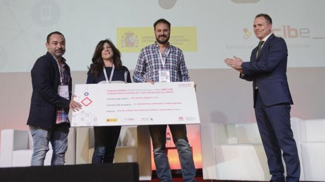

## Premios en Ciberseguridad

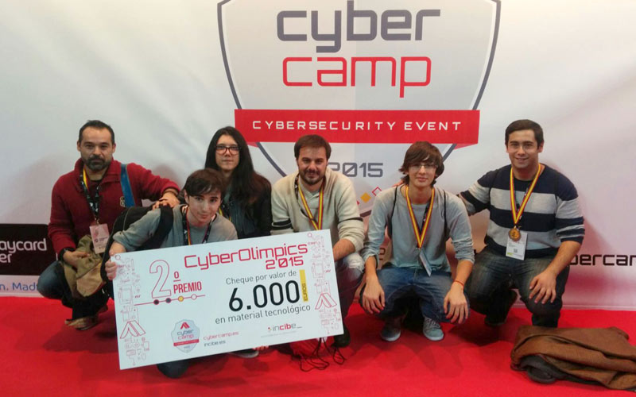
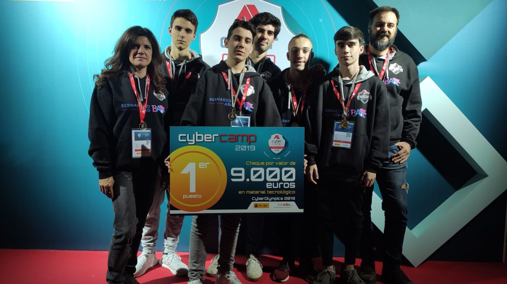	
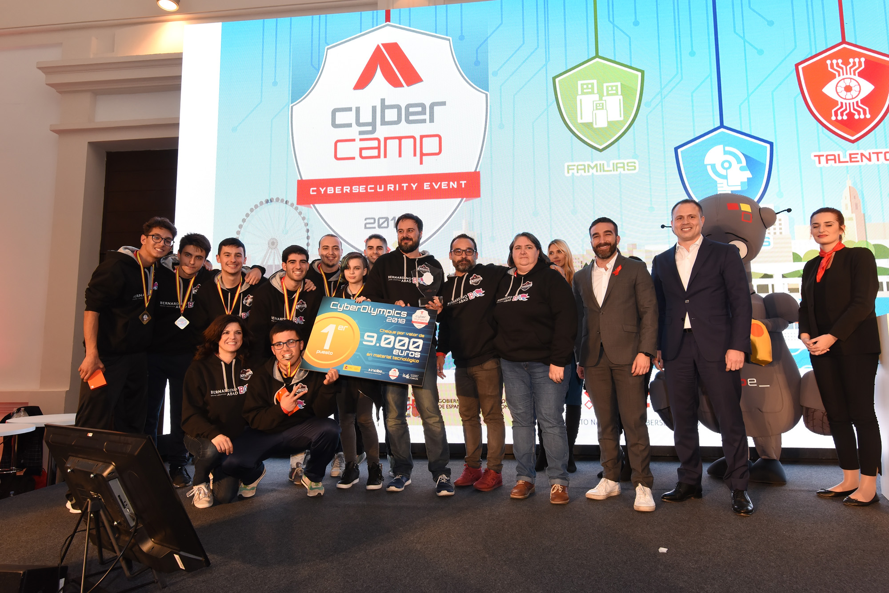					    

## Tradición en Ciberseguridad

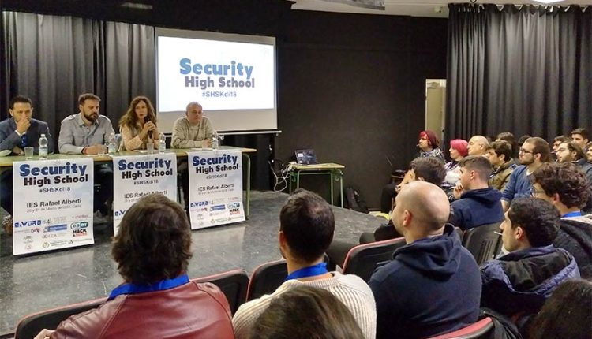
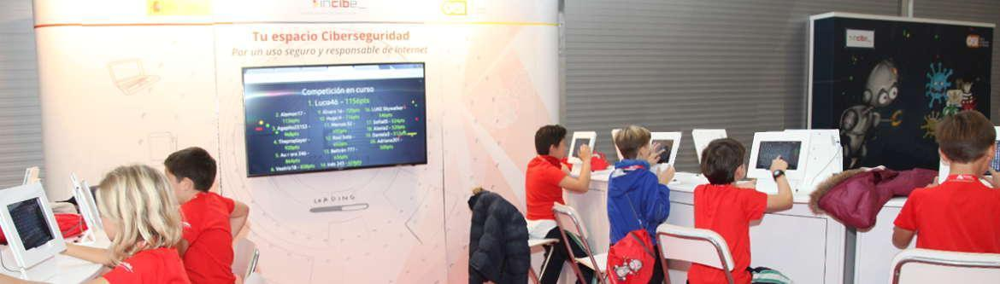	
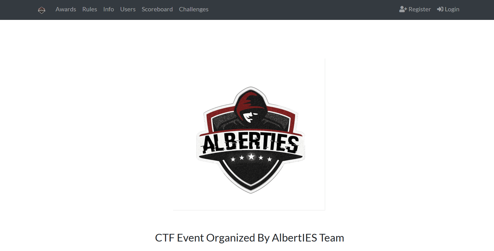		
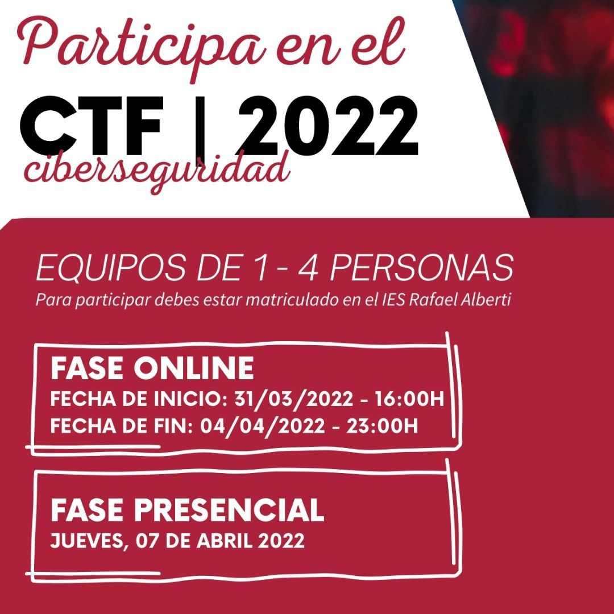				    

## El centro en la prensa

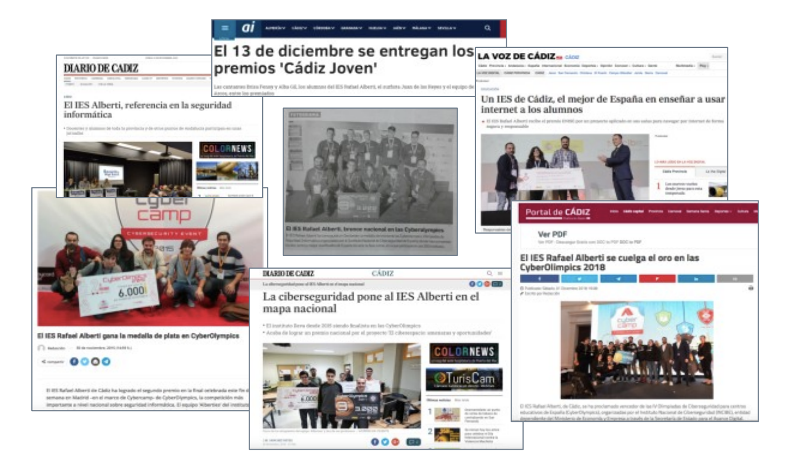

---

## Papel de los centros en la FP

					    

---

## ¿Qué necesita la empresa?

## 

<!-- .slide: data-background-image="assets/seguridad.jpg" data-background-opacity="1"-->

## ¿Cómo se combate la inseguridad?

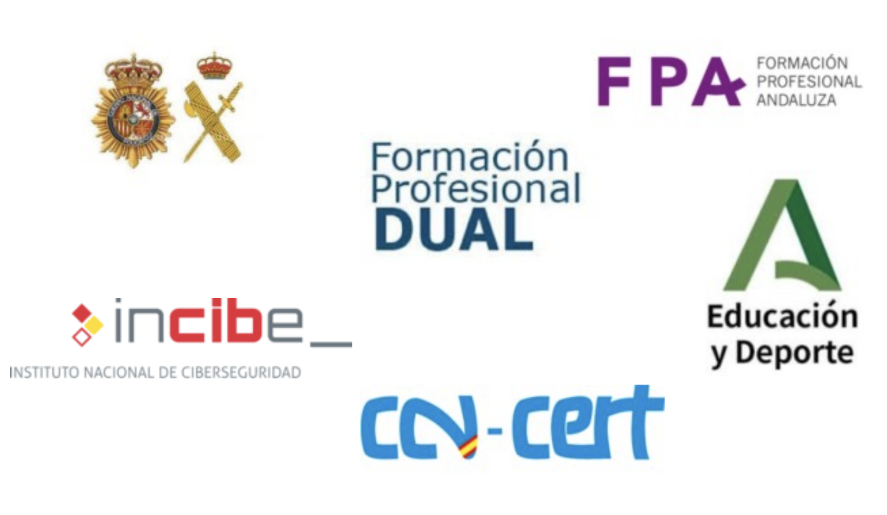
---

## Desarrollo del currículo

## Currículo Curso de Especialización en Ciberseguridad

	
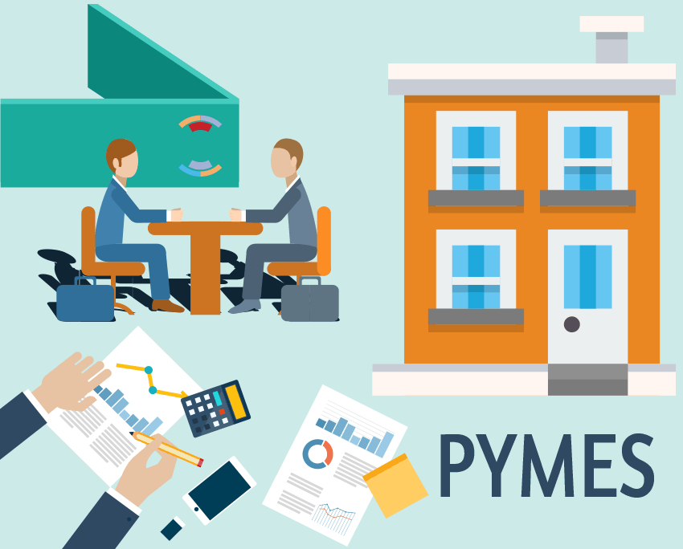					    

## Curso de Especialización

**TÍTULO**

Ciberseguridad en Entornos de las TIC

**FAMILIA PROFESIONAL**

Informática y Comunicaciones

**PERIODO DE REALIZACIÓN**

1 curso académico

720h – 43 créditos ECTS

---

## ¿Cuál es el estado de la ciberseguridad en españa?

---

## Existen dos tipos de personas

## La que ha sido hackeada

## La que no sabe que ha sido hackeada

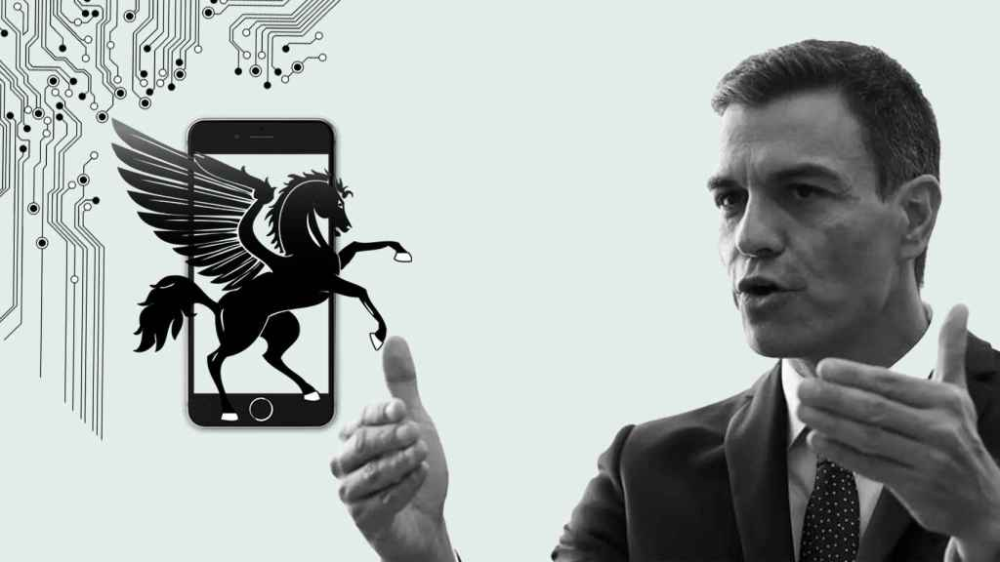

---

## No existe la seguridad total...

## ...sino una seguridad gestionada

---

## ¿Cómo lo conseguimos?

## Bastionado de Redes y Sistemas

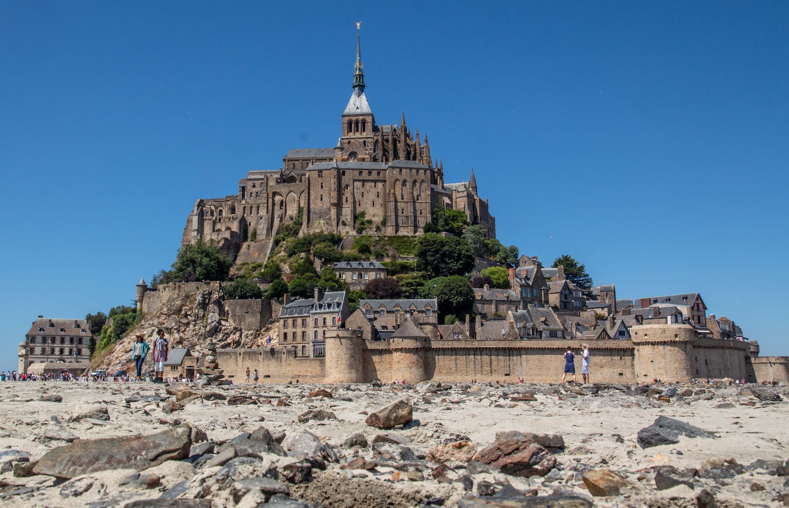

## Puesta en Producción Segura

## Hacking Ético

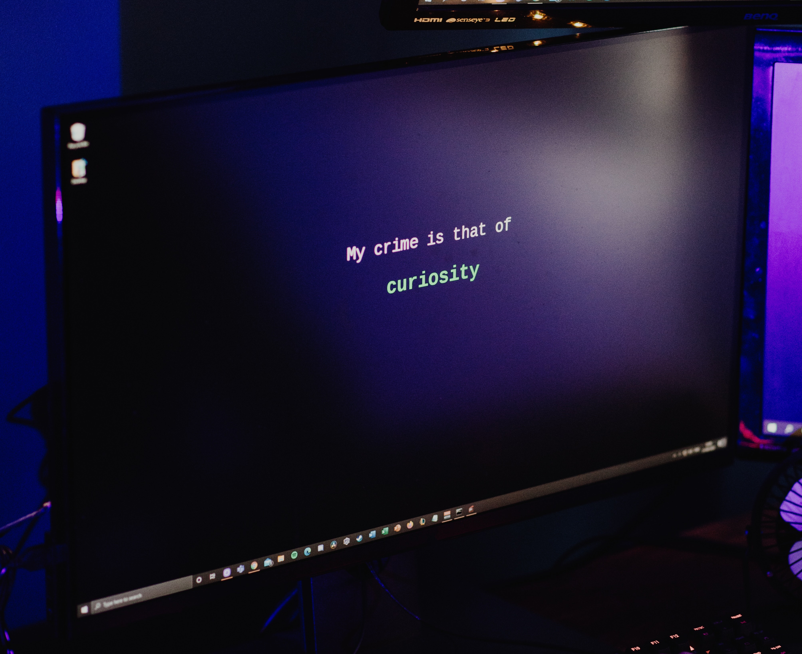

## Análisis Forense

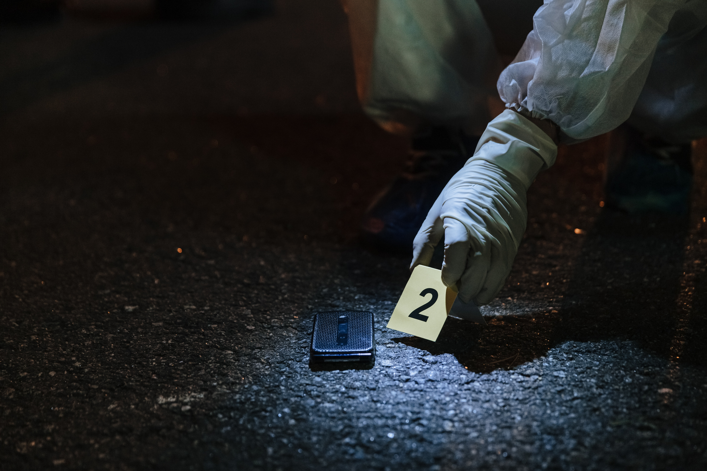

## Incidentes de Ciberseguridad

## Normativa de Ciberseguridad

---

## Distribución horaria

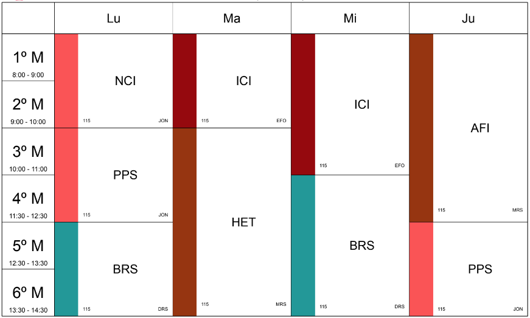

---

## De forma presencial

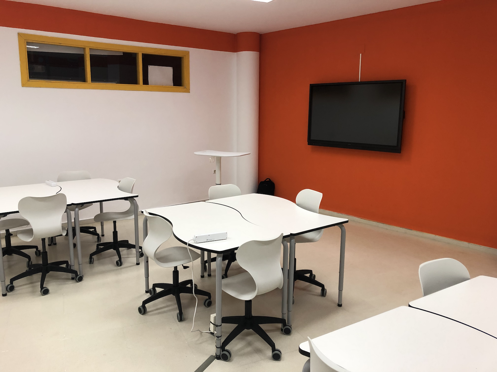

## 

## Proyectos intermodulares

Todo tiene sentido en conjunto

Acercamiento a la realidad

---

## ¿Qué material necesito?

					    <ul style="margin: 0.5em">Materiales proporcionados por el equipo educativo </ul>
					     <ul style="margin: 0.5em">Do your own research!</ul>
               <ul style="margin: 0.5em">Portátil propio</ul>
               

					    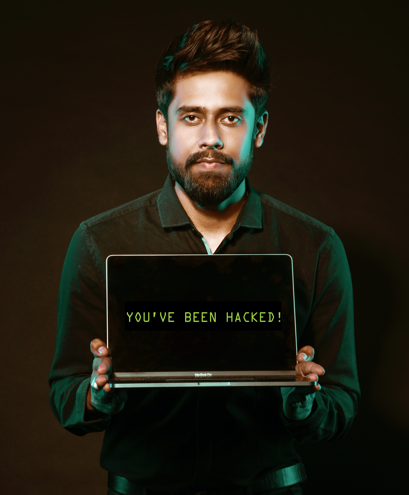

---

<!-- .slide: data-background-video="assets/searching.mp4" data-background-opacity="0.6" data-background-video-loop data-background-video-muted-->

## Dudas

---

<!-- .slide: data-background-image="assets/happy-hacking.jpg" data-background-opacity="0.6"-->

## Bienvenidos y...

### Happy Hacking !!!
