<!-- .slide: class="cover" data-state="is-cover" -->

Curso 2026-27

<h1>Ciberseguridad en Entornos de las TIC</h1>

Curso de Especialización · IES Rafael Alberti, Cádiz

Note: La novedad del curso va en la portada: este año es dual.

---

<!-- .slide: class="divider" -->

## De dónde venimos

## Premio Nacional ENISE

Mejor iniciativa en materia de ciberseguridad implantada en centros educativos

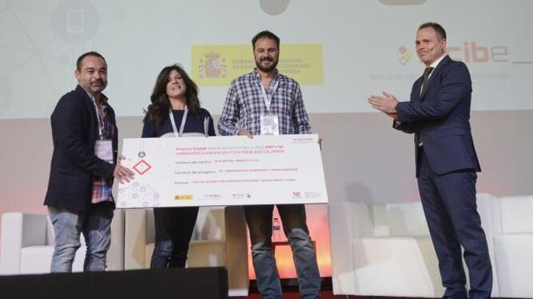

## Premios en ciberseguridad

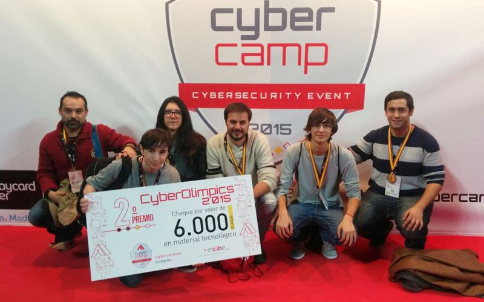

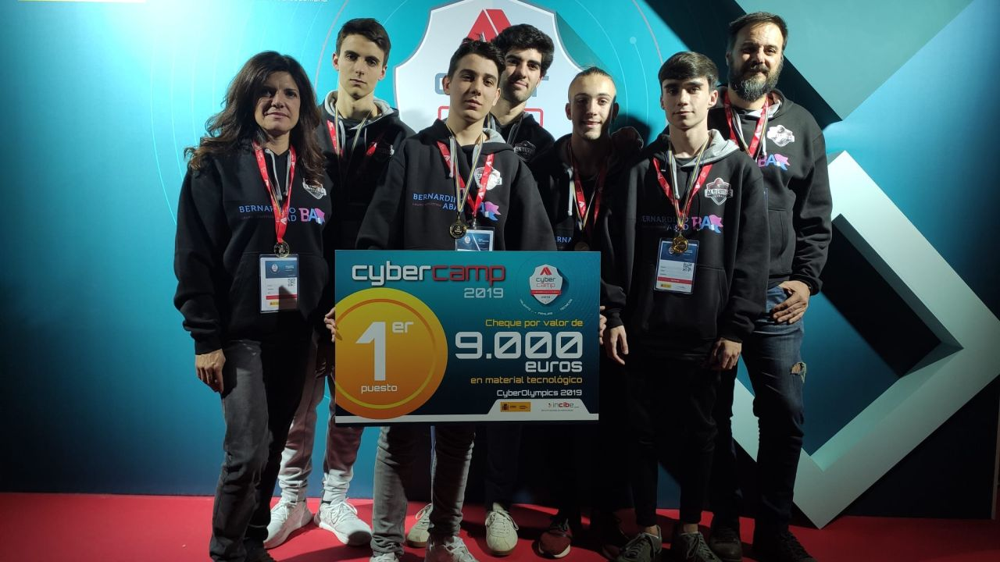

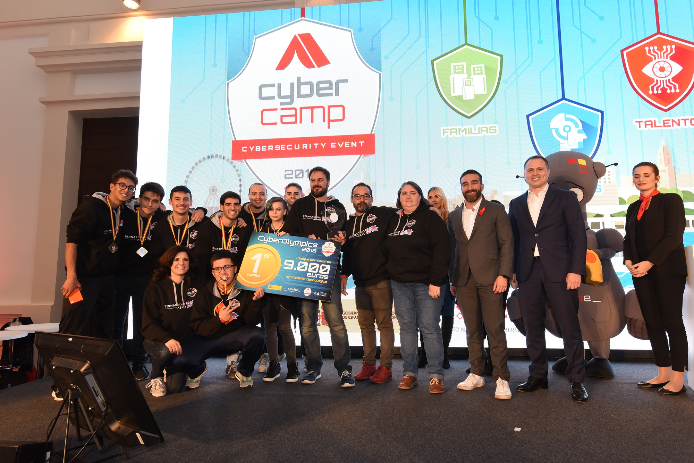

## Tradición en ciberseguridad

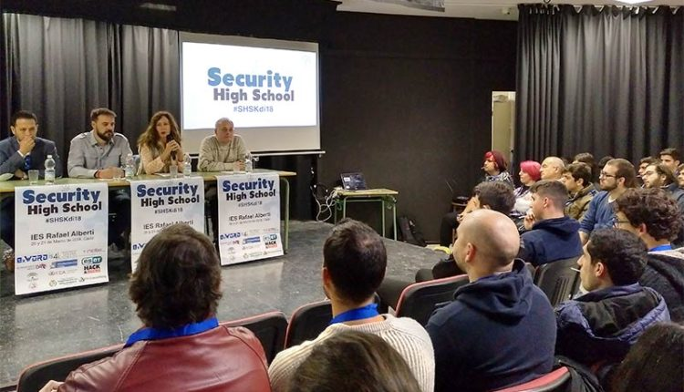

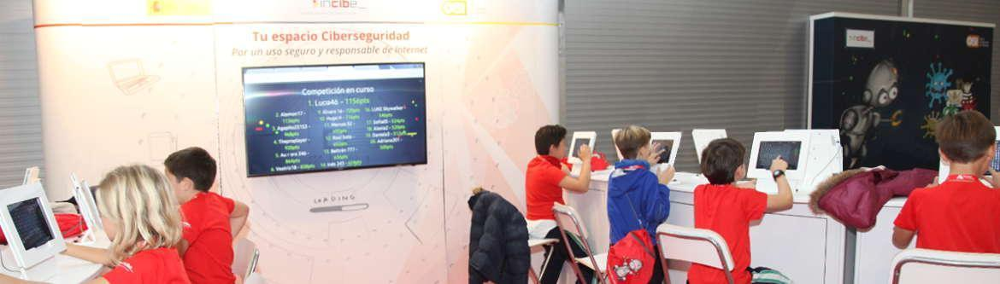

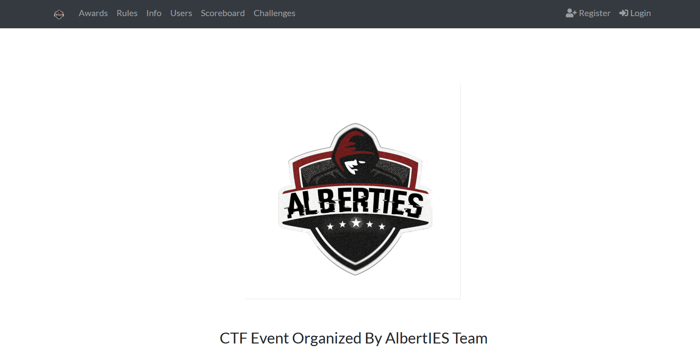

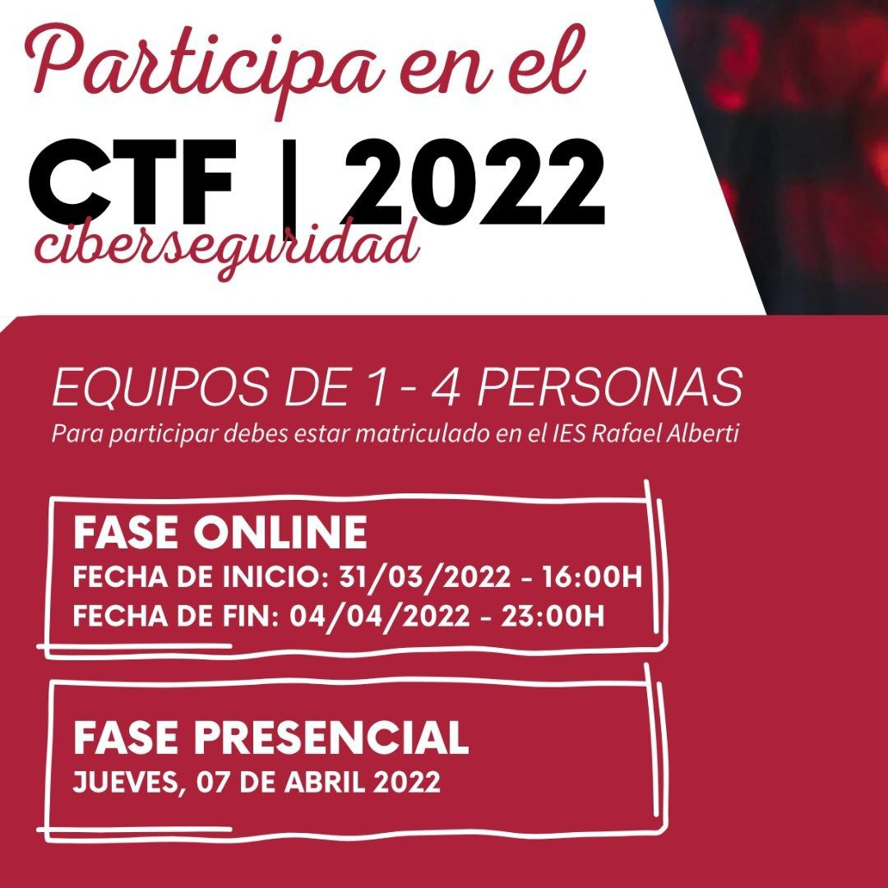

## El centro en la prensa

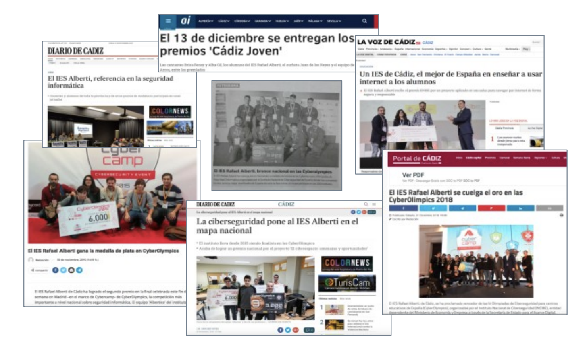

---

<!-- .slide: class="divider" -->

## ¿Qué necesita la empresa?

## El papel de los centros de FP

## ¿Cómo se combate la inseguridad?

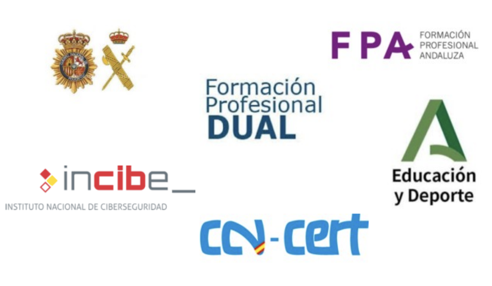

---

<!-- .slide: class="divider" -->

## Curso de Especialización

## Ficha del curso

TítuloCiberseguridad en Entornos de las TIC

Familia profesionalInformática y Comunicaciones

Duración1 curso académico · 720 h · 43 ECTS

ModalidadPresencial y <strong class="accent">dual</strong>

HorarioLunes a jueves, de 8:00 a 14:30

---

<!-- .slide: class="divider" -->

## ¿Cuál es el estado de la ciberseguridad en España?

## Estado de la ciberseguridad

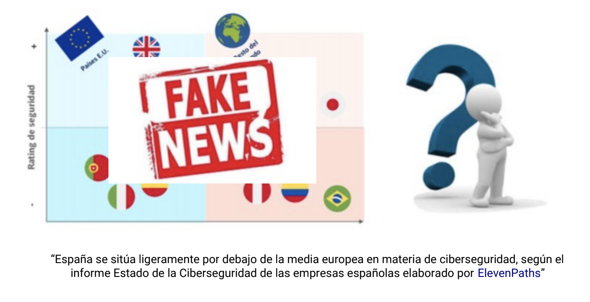

<!-- .slide: class="divider" -->

## Existen dos tipos de personas

## La que ha sido hackeada…

## …y la que no sabe que ha sido hackeada

## No existe la seguridad total…

## …sino una seguridad gestionada

---

## Módulos profesionales

<b>BRS</b>Bastionado de Redes y Sistemas5 h

<b>HET</b>Hacking Ético4 h

<b>ICI</b>Incidentes de Ciberseguridad5 h

<b>PPS</b>Puesta en Producción Segura4 h

<b>AFI</b>Análisis Forense Informático4 h

<b>NCI</b>Normativa de Ciberseguridad2 h

Horas semanales · 24 h en total

<h3>Bastionado de Redes y Sistemas</h3>
<ul class="plain small"><li>Planes de securización y redes seguras</li><li>Control de acceso y autenticación</li><li>Configuración segura de sistemas</li></ul>

<h3>Puesta en Producción Segura</h3>
<ul class="plain small"><li>Pruebas de aplicaciones web y móviles</li><li>Detección y corrección de vulnerabilidades</li><li>Despliegue seguro de software</li></ul>

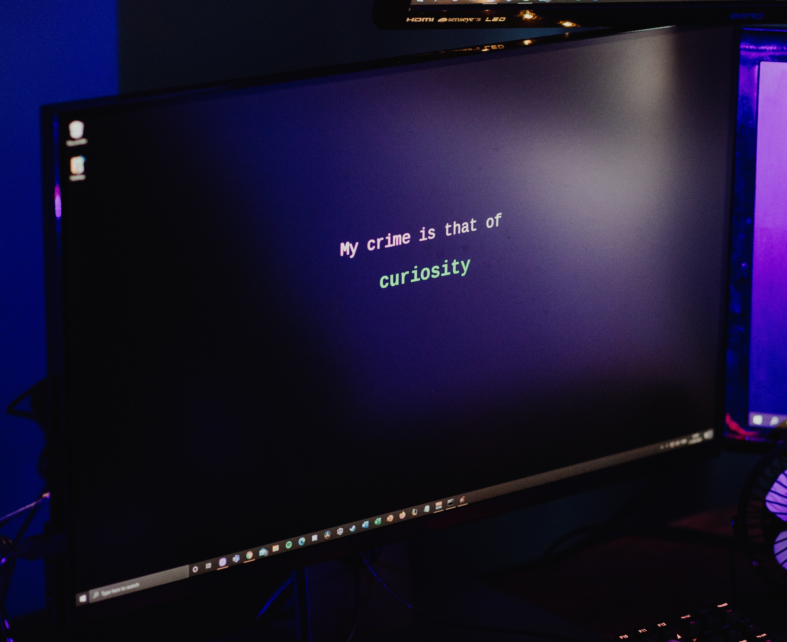

<h3>Hacking Ético</h3>
<ul class="plain small"><li>Monitorización y detección de vulnerabilidades</li><li>Ataque y defensa de redes, sistemas y web</li><li>Consolidación de sistemas comprometidos</li></ul>

<h3>Análisis Forense Informático</h3>
<ul class="plain small"><li>Metodologías de análisis forense</li><li>Móviles, cloud e IoT</li><li>Elaboración de informes</li></ul>

<h3>Incidentes de Ciberseguridad</h3>
<ul class="plain small"><li>Prevención y concienciación</li><li>Detección e investigación de incidentes</li><li>Respuesta y documentación</li></ul>

<h3>Normativa de Ciberseguridad</h3>
<ul class="plain small"><li>Cumplimiento normativo</li><li>Protección de datos</li><li>Esquema Nacional de Seguridad</li></ul>

---

<!-- .slide: class="divider" -->

## Formación dual

## ¿Qué significa?

En la empresa252 hEl 35 % de las 720 horas del curso.

RégimenGeneralSin contrato laboral. Sigues siendo alumnado del centro.

Seguimiento2 tutoresUno en la empresa y otro en el centro, con un plan de formación evaluable.

Note: Confirmar con jefatura los detalles del régimen general (Seguridad Social, plan de formación). 252 / 720 h = 35 %, límite del régimen general.

## Calendario del curso

<b>En el centro</b>28 sep – 25 feb · 74 días · 444 h

<b>En la empresa</b>2 mar – 19 may · 42 días · 252 h

<b>28 de septiembre</b>Inicio de las clases

<b>23 dic – 8 ene</b>Vacaciones de Navidad

<b>25 de febrero</b>Último día en el centro

<b>2 de marzo</b>Incorporación a la empresa

<b>22 – 26 de marzo</b>Semana Santa

<b>19 de mayo</b>Fin de la formación en empresa

Note: Clases de lunes a jueves, 6 h/día. Festivos: 12 oct, 2 nov, 7 y 8 dic, 1 mar. Dual: 42 días del 2 de marzo al 19 de mayo (cuentas del departamento). Faltan los festivos locales.

## Día a día

<h4>Sep 26</h4>
LMXJVSD123456789101112131415161718192021222324252627282930

<h4>Oct 26</h4>
LMXJVSD12345678910111213141516171819202122232425262728293031

<h4>Nov 26</h4>
LMXJVSD123456789101112131415161718192021222324252627282930

<h4>Dic 26</h4>
LMXJVSD12345678910111213141516171819202122232425262728293031

<h4>Ene 27</h4>
LMXJVSD12345678910111213141516171819202122232425262728293031

<h4>Feb 27</h4>
LMXJVSD12345678910111213141516171819202122232425262728

<h4>Mar 27</h4>
LMXJVSD12345678910111213141516171819202122232425262728293031

<h4>Abr 27</h4>
LMXJVSD123456789101112131415161718192021222324252627282930

<h4>May 27</h4>
LMXJVSD12345678910111213141516171819202122232425262728293031

<h4>Jun 27</h4>
LMXJVSD123456789101112131415161718192021222324252627282930

<i style="background:var(--al-ink)"></i>Centro<i style="background:var(--al-accent)"></i>Empresa<i style="background:var(--al-soft);border:1px solid var(--al-line)"></i>Festivo o vacaciones

---

## Horario 2026-27

<table class="horario"><tr><th></th><th>Lunes</th><th>Martes</th><th>Miércoles</th><th>Jueves</th></tr><tr><td class="tr">8:00 – 9:00</td><td class="s" rowspan="3">BRS<small>DRS</small></td><td class="s" rowspan="4">AFI<small>MRS</small></td><td class="s" rowspan="4">HET<small>MRS</small></td><td class="s" rowspan="3">ICI<small>EFO</small></td></tr><tr><td class="tr">9:00 – 10:00</td></tr><tr><td class="tr">10:00 – 11:00</td></tr><tr><td class="tr">11:30 – 12:30</td><td class="s" rowspan="2">ICI<small>EFO</small></td><td class="s" rowspan="1">NCI<small>DRS</small></td></tr><tr><td class="tr">12:30 – 13:30</td><td class="s" rowspan="2">BRS<small>DRS</small></td><td class="s" rowspan="2">PPS<small>JON</small></td><td class="s" rowspan="2">PPS<small>JON</small></td></tr><tr><td class="tr">13:30 – 14:30</td><td class="s" rowspan="1">NCI<small>DRS</small></td></tr></table>

Aula 115 · Recreo de 11:00 a 11:30

## Equipo docente

<b>David Romero Santos</b>Bastionado · Normativa

<b>Eduardo Fernández Oliver</b>Incidentes

<b>Manuel Jesús Rivas Sández</b>Forense · Hacking Ético

<b>Francisco Javier Ortega Nogueras</b>Puesta en Producción Segura

---

## De forma presencial

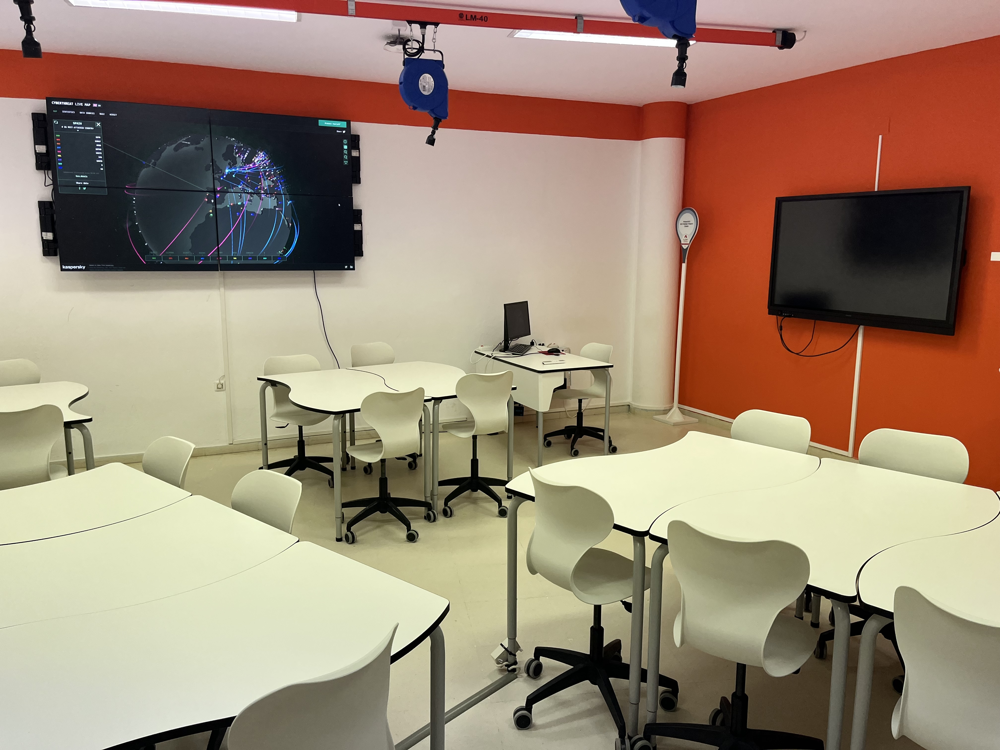

## Aula virtual

Materiales, entregas y comunicación del curso en <strong>Moodle Centros</strong>.

## Proyectos intermodulares

<ul class="plain">
<li>Todo tiene sentido en conjunto</li>
<li>Acercamiento a la realidad</li>
<li>Preparación para la etapa en la empresa</li>
</ul>

---

## ¿Qué material necesito?

<ul class="plain">
<li>Materiales del equipo educativo</li>
<li>Do your own research!</li>
<li>Portátil propio</li>
</ul>

---

<!-- .slide: class="divider" -->

## Normas del centro

## Entradas y salidas

<h4>Puntualidad</h4>
La puerta se cierra a las <strong>8:10</strong>. Si llegas tarde, esperas al siguiente tramo horario.

<h4>Salir del centro</h4>
Enseña en la puerta el <strong>DNI o el carnet de estudiante</strong>. El tutor os entregará los carnets en los próximos días.

<h4>Si falta un profesor</h4>
Para que el grupo pueda salir se rellena un documento de salida, que tiene el tutor o la tutora.

<h4>Justificar faltas</h4>
Por escrito y en un <strong>máximo de 5 días</strong>: enfermedad, causas laborales o deberes inexcusables. <strong class="accent">La ausencia de un profesor o profesora no justifica tu falta.</strong>

Note: Los retrasos reiterados e injustificados pueden dar lugar a medidas correctoras.

## En el centro

<h4>Móviles</h4>
Guardados durante toda la jornada, salvo que el profesorado autorice su uso para una actividad.

<h4>Espacios</h4>
A la zona de despachos se accede pasando antes por conserjería. En el recreo no se puede estar en aulas, pasillos ni escaleras.

<h4>Aseos</h4>
Durante las clases, de uno en uno y con permiso del profesor o profesora.

<h4>El aula</h4>
Su cuidado es responsabilidad de todo el grupo. Firmaremos el compromiso de cuidado del aula.

## Evaluación continua

Pérdida de la evaluación continua20 %Al superar el 20 % de faltas, justificadas e injustificadas.

Baja de oficio5 díasAntes del 15 de noviembre, 5 días hábiles de faltas injustificadas. Después, 45 días.

Renuncia a convocatoria2 mesesSe puede pedir hasta 2 meses antes de la evaluación.

Note: Renuncia: hasta el 50 % de la matrícula, o con matrícula completa, 2 meses antes de la evaluación. Trámites en la web del profesorado → FP → Protocolos FP.

## Trámites de inicio de curso

<h4>iPasen</h4>
Usuario y contraseña activos, y la foto actualizada <strong>tipo carnet</strong>: es la que sale en el carnet de estudiante.

<h4>Cuenta @g.educaand.es</h4>
Tu cuenta de Google del centro, con correo y almacenamiento en la nube.

<h4>Seguro escolar</h4>
Menores de 28 años: <strong>1,12 €</strong> en la secretaría virtual o 1,20 € en ventanilla. Sin él, la matrícula queda incompleta.

<h4>Uso de imagen</h4>
Si no tienes autorizado el uso de tu imagen y quieres hacerlo, díselo al tutor y te enviará la autorización por iPasen.

---

<!-- .slide: class="divider center" -->

## ¿Dudas?

---

<!-- .slide: class="divider center" data-background-image="assets/happy-hacking.jpg" data-background-opacity="0.15" -->

Bienvenidos, bienvenidas y…

## Happy hacking

